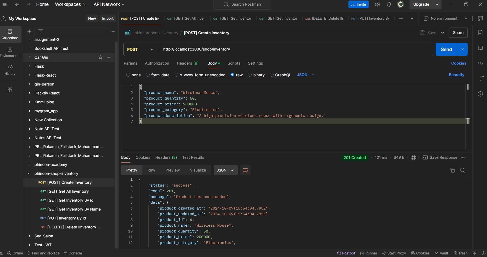

# 🔧 Assignment 3 - RESTful API Shop Inventory 🔧

This repository contains a RESTful API built with Express.js and MySQL for managing a shop's inventory. The API supports CRUD (Create, Read, Update, Delete) operations on inventory items.

## 🧑🏻‍💻 Author

- [@Muhammad Rifqi Setiawan](https://github.com/rifqi142)

## 🌐 Preview Endpoint



## 📋 Table of Contents

- [Features](#features)
- [Technologies Used](#technologies-used)
- [API Endpoints](#api-endpoints)
- [Installation](#installation)
- [Usage](#usage)

## ⚡️ Features

- Create, Read, Update, and Delete inventory items
- Validate request bodies to ensure data integrity
- Check for duplicate products before adding to the inventory
- Fetch inventory items by ID or name

## ⚙️Technologies Used

- **Node.js** - JavaScript runtime for server-side programming
- **Express.js** - Web framework for building APIs
- **MySQL** - Relational database for storing inventory data
- **Sequelize** - ORM for interacting with the MySQL database
- **Joi** - Schema description language and data validator for JavaScript

## 🎯API Endpoints

The following endpoints are available:

| Method | Endpoint                     | Description                              |
| ------ | ---------------------------- | ---------------------------------------- |
| POST   | `/shop/inventory`            | Add a new product to the inventory       |
| GET    | `/shop/inventory/all`        | Retrieve all products from the inventory |
| GET    | `/shop/inventory/:id`        | Retrieve a product by its ID             |
| GET    | `/shop/inventory/name/:name` | Retrieve a product by its name           |
| PUT    | `/shop/inventory/:id`        | Update a product by its ID               |
| DELETE | `/shop/inventory/:id`        | Delete a product by its ID               |

### 🚀 Example Request

**Creating a new inventory item:**

```bash
POST /shop/inventory
Content-Type: application/json

{
  "product_name": "Sample Product",
  "product_quantity": 10,
  "product_price": 100,
  "product_category": "Electronics",
  "product_description": "A sample product description"
}
```

**Getting All Inventory items**

```bash
GET /shop/inventory/all
```

## 🔗 Installation

### 1. Clone the repository:

```bash
git clone https://github.com/rifqi142/assignment3_muhrifqis
```

### 2. Navigate to the project directory:

```bash
cd assignment3_muhrifqis
```

### 3. Install Dependencies

```bash
npm install
```

### 4. Set up the database:

- Create a MySQL database for the inventory.
- Update your database connection settings in the Sequelize configuration.

### 5. Run the application:

```bash
npm start
```

## 💡 Usage

You can test the API using tools like [Postman](https://www.postman.com/) or cURL. Make sure to send requests with the appropriate HTTP methods and payloads as described in the API endpoints section. I have included a Postman collection in the `postman` folder for your convenience.
